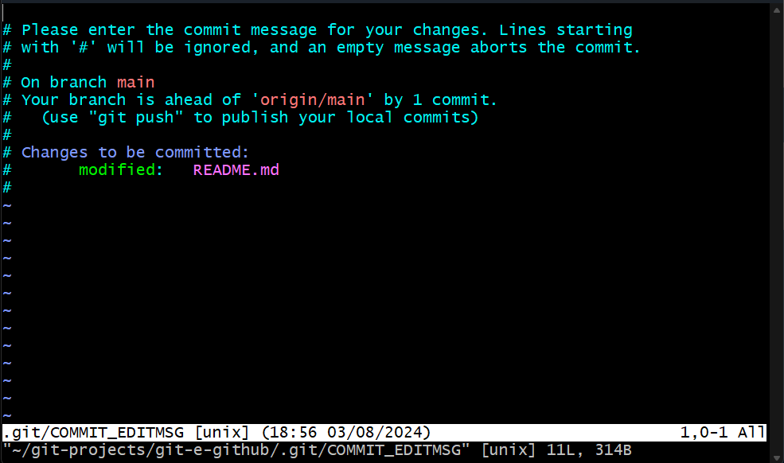
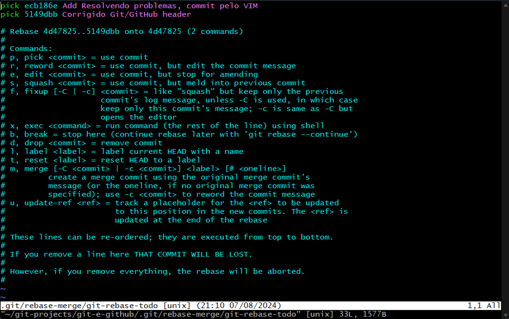
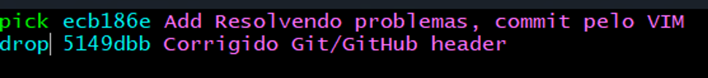

<p align="center"></p>

# Git - Sistema de versionamento:
Controla as modificações de um projeto por meio de versões chamadas "commits".

# GitHub - serviço online de hospedagem de repositórios Git remotos.

- Possui uma interface gráfica web: [github.com](http://github.com/)
- É uma plataforma social (usuários, página de perfil, seguidores, colaboração, etc.). Dica: currículo!
- Maior serviço do mundo de hospedagem de projetos de código aberto
- Modelo de cobrança: gratuito para projetos de código aberto, pago para projetos privados
- Alternativas: BitBucket, GitLab, etc.

## Repositório remoto e local:

- Um projeto controlado pelo Git é chamado de **repositório** de versionamento.
- Tipicamente uma cópia "oficial" do repositório fica salvo em um **servidor** (**<span style="color:orange">repositório remoto</span>**).
- Cada pessoa que trabalha no projeto pode fazer uma cópia do repositório para seu computador (**<span style="color:orange">repositório local</span>**). A pessoa então faz suas alterações no projeto (novos commits) e depois salva as alterações no servidor.

# Configurando identificação no Git:

```bash
git config --global user.name "Seu nome" # Configurar nome.

git config --global user.email "Seu email de cadastro do Github" # e-mail.

git config --list # visualizar alterações.
```

## Configurar chave SSH para o Github:

- O Github aboliu a autenticação somente com usuário e senha.

### **Secure Shell Protocol (SSH)**:

A ideia básica é cadastrar previamente quais computadores podem acessar o Github em seu nome. Outros computadores não conseguem acessar

#### Para isso, você deve:

- (1) Gerar uma chave SSH no seu computador: https://docs.github.com/en/authentication/connecting-to-github-with-ssh/generating-a-new-ssh-key-and-adding-it-to-the-ssh-agent
- (2) Cadastrar essa chave no seu Github

# Salvando e alterando projetos no GitHub:

## Salvar primeira versão de um projeto no Github:

Considerando que agora seu ambiente já está todo configurado (usuário e email, visualização de arquivos ocultos, chave SSH), sempre que você criar um novo projeto, os passos básicos serão estes:

```bash
git init # 1. Inicializar Git, cria a pasta no local.

git add . # 2. selecionar arquivos na pasta atual. Deixar na área de "stage"

git commit -m "Mensagem explicativa" # 3. Salvar uma versão do projeto

git branch -M main # 4. Garantir que o branch seja salva no main e não no master.

# Associar projeto local(computador) com projeto remoto(GitHub).
git remote add origin git@github.com:seuusuario/seurepositorio.git

git push -u origin main # De fato enviar ao GitHub

# plus:
git status # : ver status atual do projeto.
```

## Salvar uma nova versão:

```bash
git status # Checar status do projeto

git add . # Selecionar arquivos da pasta. Deixar na área de "stage"

git commit -m "Mensagem explicativa" # Salvar uma versão do projeto

git push # Enviar commit.
```
## Clonar e modificar um repositório remoto que você tem permissão para alterar:

```bash
git clone git@github.com:seuusuario/seurepositorio.git # Clonar projeto a partir de chave ssh

git add .

git commit -m "Mensagem explicativa"

git push

# Plus: Abrir vs code quando já na pasta do Projeto pelo Git Bash:
code .
```

# Git Status, add e stage:

## Status (Verificar estado atual do projeto):

```bash
git status
```
### Mensagens possíveis:

- quando algo no projeto é modificado, a mensagem <span style="color:red">**modified**</span> é exibida.
- quando um arquivo novo é criado e ainda não é localizado no repositório ou stage (não rastrado), a mensagem <span style="color:red">**untracked**</span> é exibida.
- quando um arquivo é deletado e ainda é localizado no repositório ou stage, a mensagem <span style="color:red">**deleted**</span> é exibida.

#### Quando todas as alterações estão salvas no repositório remoto ou no stage, mensagem a seguir:

```bash
nothing to commit, working tree clean
```

## Git add:

Adiciona arquivos e atualizações na árvore de trabalho (working tree) à área de preparação (staging area). É possível adicionar todos os arquivos utilizando "." ou apenas um único arquivo para a área de preparação, usando o mesmo comando e indicando o nome do arquivo ao invés do ponto, deixando os demais fora do stage:

```bash
git add . # todos os arquivos para stage
git add sobre.html # apenas sobre.html para stage
```

# Verificando o histórico de versões:

## Histórico detalhado com data:

```bash
git log
```

- ao utilizar, para sair do modo basta apertar a tecla **Q**

## Histórico resumido em uma linha (bom para projetos grandes):

```bash
git log --oneline
```

## Git Diff:

comando usado para visualizar as diferenças entre arquivos, pode ser feito tando no próprio terminal GitBash quanto visualizado através de uma interface gráfica em uma IDE, como no VS Code, por exemplo.

```bash
git dif nome_do_aquivo
```

## Git checkout:

- Permite retornar e modificar temporariamente os arquivos do projeto ao estado de um dado commit ou branch.
- Cada commit possui um código, que pode ser utilizado para referenciar o commit.
- Esse código pode ser visualizado através do histórico de commits no GitHub ou através do git log dentro do git bash do repositório.

```bash
git checkout código_do_commit
```

### HEAD:

- **O último commit do histórico do branch corrente também pode ser referenciado pela palavra <span style="color:red">**HEAD**</span>**
- É possível referenciar um commit X versões antes de HEAD usando HEAD~X, por exemplo:

```bash
git checkout HEAD~1 # penúltimo commit
git checkout HEAD~2 # antepenúltimo commit
```

### Voltando ao HEAD (versão atual do projeto):

#### IMPORTANTE: antes de fazer o checkout para voltar para HEAD, certifique-se de que não haja mudanças nos arquivos. Se você acidentalmente mudou alguma coisa, desfaça as modificações usando:

```bash
git reset # tirar os arquivos da área de stage.
 
git clean -df # forçar remoção de arquivos não rastreados e diretórios vazios.

git checkout -- . # limpar modificações de arquivos
```

#### Para de fato voltar ao HEAD (Commit atual):

```bash
git checkout main 
# retorna ao estado atual (HEAD) na branch main, que é o commit atual dessa branch.
```
# Arquivo .gitignore:

## É um arquivo que indica o que NÃO deve ser salvo pelo Git.

- Geralmente o arquivo .gitignore fica salvo na pasta principal do repositório. Mas também é possível salvar outros arquivos .gitignore em subpastas do repositório, para indicar o que deve ser ignorado por cada subpasta. Como em projetos de back e front end em diferentes frameworks e com diferentes tipos de arquivos que devem ser iginorados.

## Casos comuns de arquivos que não devem ser salvos pelo Git:

### • Arquivos compilados:

<span style="color:royalblue">Linguagens compiladas (C, C++, Java, C#, etc.) geram arquivos de código compilado para executar o programa localmente.</span>

### • Arquivos de bibliotecas externas usadas no projeto:

<span style="color:royalblue">Projetos reais utilizam bibliotecas externas (programas prontos disponíveis na Internet). Por exemplo, projetos JavaScript com NPM tipicamente salvam uma subpasta "node_modules" na pasta do seu projeto.</span>

### • Arquivos de configuração da sua IDE:

<span style="color:royalblue">IDE's podem salvar uma subpasta com arquivos de configuração na pasta do projeto (exemplo: .vscode).</span>

### • Arquivos de configuração do seu sistema:

<span style="color:royalblue">Por exemplo, sistemas Mac podem gravar uma subpasta .ds_store na pasta do projeto.</span>

# ReadMe
O arquivo ReadMe.md funciona como a principal fonte de informações para usuários e desenvolvedores 
em repositórios GitHub. Ele é escrito em markdown (.md), que é uma linguagem de marcação assim como html. 

## Por que utilizar ReadMe em projetos GitHub?

### Apresentação do Projeto:

Explica do que se trata o projeto e seu propósito.

### Documentação Técnica:

Fornece detalhes sobre a arquitetura, tecnologias usadas e estrutura de arquivos.

### Instruções de Uso:

Ensina como instalar, configurar e executar o projeto.

### Contribuição:

Orienta como contribuir para o projeto, incluindo pré-requistiros, diretrizes para pull requests e relatórios de problemas.

## Elementos interessantes que podem ser adicionados no ReadMe:

### Código e Formatação:
Exemplos de código e badges em Markdown para destacar informações como status do projeto.

```chsarp
Console.WriteLine("Hello");
```

### Licença:
Define como o código pode ser usado, como a licença MIT, que permite uso comercial e modificações.

[](https://github.com/Naereen/StrapDown.js/blob/master/LICENSE)

### Recursos Visuais e Adicionais: 
Imagens, gifs, vídeos e badges podem ser adicionados para ilustrar o uso e funcionalidades do projeto.

# Resolvendo problemas comuns com Git:

```bash
Boa prática: sempre utilizar git status para vericar o status 
atual do projeto antes de fazer modificações.
```

## Removendo arquivos da área de Stage (Unstaged):

```bash
git reset
```

## Desfazer modificações não salvas (voltar ao último commit / HEAD):

```bash
git reset # tirar os arquivos da área de stage.
 
git clean -df # forçar remoção de arquivos não rastreados e diretórios vazios.

git checkout -- . # limpar modificações de arquivos

```

## Editor VIM:

Editor de texto configurável que é incluso junto ao Git Bash no ato de sua instalação. É usado como editor padrão para escrever mensagens de commit, editar arquivos de configuração e resolver conflitos de merge, proporcionando edição rápida e eficiente no terminal

### VIM pode ser aberto no terminal quando é feito um commit sem mensagem:

```bash
git commit
```



### Comandos básicos:

#### Habilitar o modo de edição:

```bash
i
```

#### Sair do VIM, salvando as alterações:

```bash
<ESC>
:wq # write / quit
<ENTER>
```

#### Sair do VIM, descartando as alterações:

```bash
<ESC>
:q! # quit
<ENTER>
```

## Desfazendo e Deletando Commits:

### Desfazer último commit mantendo as alterações:

```bash
git status # conferir status atual
git reset --soft HEAD~1 # desfazer o último commit mantendo as alterações.
```

### Deletando commits e modificações nos arquivos (repositório local):

#### Voltar o projeto ao estado de um dado commit, (deletando commits e alterações posteriores):

```bash
git status # conferir status atual

git reset --hard <código do commit> # executar ação com base no código do commit.
```

#### Exemplo: voltar o projeto ao estado do penúltimo commit:

```bash
git reset --hard HEAD~1
```

## Deletando histórico de commits em repositório remoto:

### ALERTA: Operação destrutiva e irreversível: recomenda-se clonar o repositório localmente antes de executar, pois não será possível recuperar o histórico de commits deletado.

```bash
git rebase -i <código do commit> # realizar rebase interativo no VIM.
```

### Exemplo com <HEAD~2>, **VIM** Será aberto da forma abaixo:



#### Para indicar qual commit será deletado, basta entrar no modo de edição (TECLA i), substituir no o “pick” por “drop”, salvar a alteração e sair utilizando “:wq”, assim executando a remoção localmente.



### Para finalizar, basta fazer um push forçado utilizando o comando abaixo:

```bash
git push --force
```

## Atualizando repositório local em relação ao Remoto:

- Atualização em casos do repositório local estar em versões anteriores ao remoto:

```bash
git log # conferir histórico atual de commits do projeto

git pull <nome do remote> <nome do branch> # Atualizar em relação ao remoto.
# ex projeto atual: git pull origin main
```
